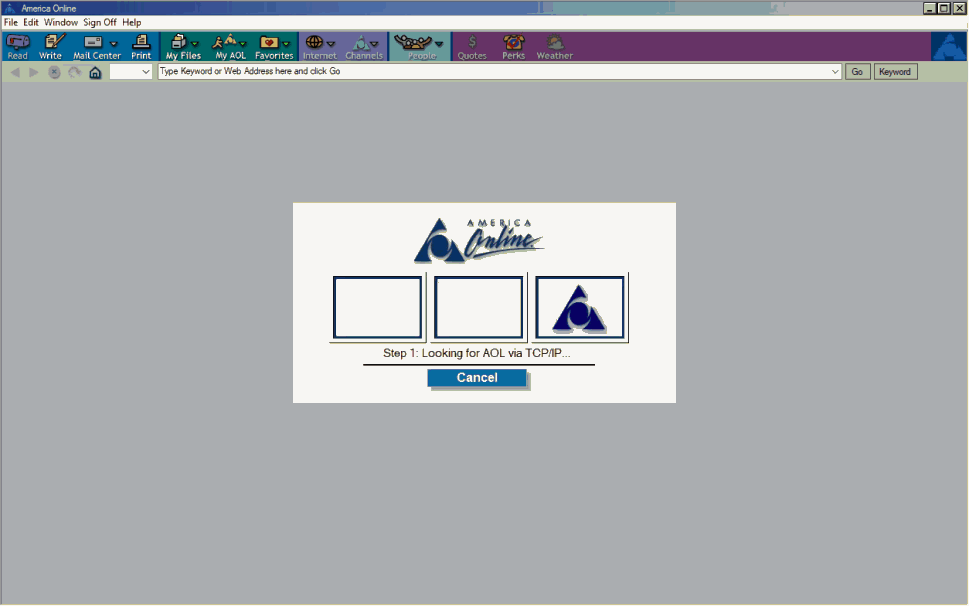

AOL 4.0 rebuilt with C# Winforms and Chromium. [aolemu.com](https://aolemu.com)

## WHAT WORKS
- Web browsing. Loading icon in right corner shows loading animation.
- Account registration/login. This registers your account on Snoonet IRC and creates an email (ACCOUNT)@aolemu.com
- Add buddies, show online/offline status
- Chatroom uses Snoonet IRC. Use the chatroom form to browse and join rooms.
- Welcome form shows temperature and all 4 left side channels open forms
- Send/Receive emails in the mailcenter form.
- Sending private messages. (form is not complete)
- System checks for new emails regularly and will announce with "You've got mail" and icon change in toolbar.

## HOW TO COMPILE
Open the .sln file with [Visual Studio](https://visualstudio.microsoft.com/thank-you-downloading-visual-studio/?sku=Community&rel=16), right click on the project in VS and click "Restore Nuget Packages". Now click compile and you'll get the .exe file.

## FOR END USERS 
Visit https://github.com/erfg12/AOL_4.0_Emu/releases and download the latest zip version. Install the [Evergreen Bootstrap](https://developer.microsoft.com/en-us/microsoft-edge/webview2/#download-section) for WebView2.

## HOW YOU CAN HELP
* First, star and/or watch this project. 
* Second, use the program. If you notice any crashes or bugs, open an issue ticket and detail what happened along with a crash report if you can.

* If you can find any screenshots or video of forms or windows that were available at the time, submit them to this issue ticket: https://github.com/erfg12/AOL_4.0_Emu/issues/10

## SAMPLE SCREENSHOTS

Here's a compressed animated gif of the dial up, loading animation and MIE badge:

